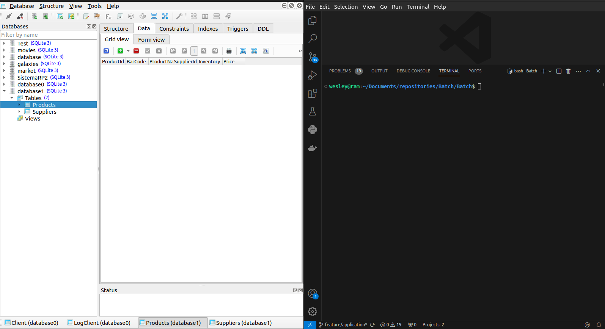
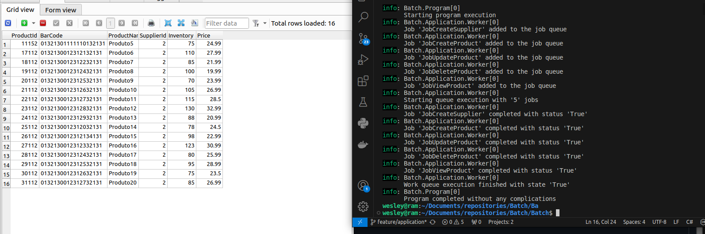
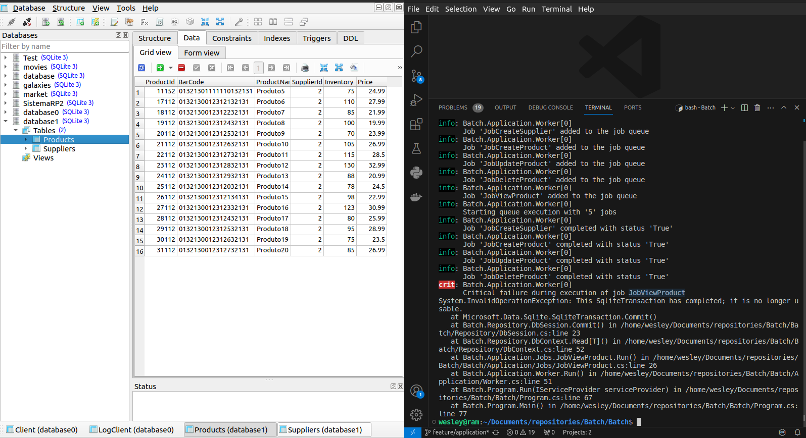

# Batch

Uma aplicação simples de console que realiza um CRUD no banco de dados a partir da leitura de arquivos .csv usando o modelo worker-job.

* Worker: instância que coordena uma fila de trabalhos (Jobs) a serem executados em ordem de chegada (FIFO). Os Jobs podem ser independentes ou dependentes de outros - se houver dependências a ordem na fila deve ser seguida. Caso um job falhe, então a execução da fila é paralisada e o programa encerrado com erro.
* Job: instância que representa uma operação ou trabalho a ser executado. Cada Job implementa a interface IJob e define a sua própria implementação do método Run().

O intuito deste projeto é estudar e praticar o uso de alguns pacotes conhecidos do .Net

## Tecnologias utilizadas

* .NET Core - Console application
* SQLite - Database serverless
* Dapper - Micro ORM
* CsvHelper - leitura e escrita de arquivos .csv
* Logging: escrita de log no console
* Configuration: carregamento de arquivos de configuração
* DependencyInjection: injeção de dependências

## Camadas

O Batch é modulado em diferentes camadas com suas respectivas responsabilidades. 
* Domain: contém os modelos, entidades e enumerações que representam os dados manipulados pela aplicação.
* Repository: contém as classes e interfaces que manipulam a conexão com o banco de dados. O banco de dados é manipulado usando o micro-ORM Dapper. 
* Services: contém a implementação dos serviços que são utilizados pela aplicação:
    * LocalFiles: manipulação dos arquivos locais com System.IO.File
    * CsvService: conversão de arquivos .csv em objetos usando CsvHelper
* Application: contém a implementação da lógica de negócio da aplicação e uso dos serviços implementados:
    * FileHandler: manipulação do LocalFiles e CsvService
    * Worker: enfileiramento e execução de jobs
    * Jobs: operações CRUD a serem executadas
* Extensions: contém as configurações de injeção de dependências da aplicação
* Configurations: contém os arquivos de configuração da aplicação

## Criação de Jobs

Para criar um job é necessário criar uma instância de IWorker e chamar o método genérico **CreateJob<T>()**, no qual o tipo **T** representa o tipo de job a ser adicionado na fila.

    var worker = serviceProvider.GetRequiredService<IWorker>()  
        .CreateJob<JobCreateSupplier>()
        .CreateJob<JobCreateProduct>()
        .CreateJob<JobUpdateProduct>()
        .CreateJob<JobDeleteProduct>()
        .CreateJob<JobViewProduct>();
    await worker.Run();

#### Execução dos Jobs

Após os jobs serem criados, cada um será executado seguindo a ordem de adição (FIFO). As alterações realizadas por um job no banco de dados (INSERT, UPDATE e DELETE) só serão confirmadas se a execução for completada com sucesso. Caso ao contrário, as alterações realizadas no banco de dados serão revertidas (rollback).

    try
    {
        _workStatus = true;
        while (_workQueue.Any() && _workStatus)
        {
            _currentJob = _workQueue.Dequeue();
            _uow.BeginTransaction();
            var response = await _currentJob.Run();
            _uow.Commit();
            _workStatus = !_notifier.HasNotificationType(NotificationLevel.ERROR);
        }
        _currentJob = null;
        return _workStatus;
    }
    catch(Exception)
    {
        _uow.Rollback();
        throw;
    }

## Banco de dados da aplicação

A aplicação utiliza o SQLite para persistência e gerenciamento dos dados. A camada de dados implementa o padrão repositório (Repository Pattern) baseado em unidade de trabalho (Unit of Work) para manipulação de transações.

O esquema do banco de dados contém as seguintes tabelas:
* Products: registra tipos de produtos
    * ProductId, BarCode, ProductName, SupplierId, Inventory, Price
* Suppliers: registra fornecedores de produtos
    * SupplierId, SupplierName, ActiveContract

## Layout dos arquivos

Arquivos que são lidos:

* YYYYMMDD_VERSION_products_create.csv: dados para cadastrar novos produtos
* YYYYMMDD_VERSION_products_update.csv: dados para atualizar produtos
* YYYYMMDD_VERSION_products_delete.csv: dados para remoção de produtos
* YYYYMMDD_VERSION_suppliers_create.csv: dados para cadastrar novos fornecedores de produtos

Arquivos que são gravados:

* YYYYMMDD_VERSION_products_view.csv: dados representando os produtos cadastrados em uma determinada data

Os arquivos são sempre buscados no diretório files/input e movidos depois do processamento para o diretório files/output. 

## Prints

